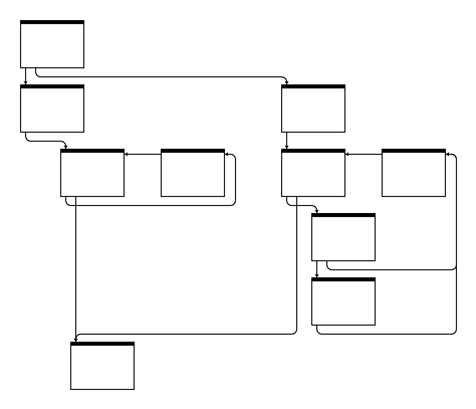

# iongraph

An interactive visualizer for the SpiderMonkey Ion compiler backend. For more information about the design and motivation, see the [blog post](https://spidermonkey.dev/blog/2025/10/28/iongraph-web.html).



## Developing

To run the viewer locally:

```
npm install
npm run serve
```
